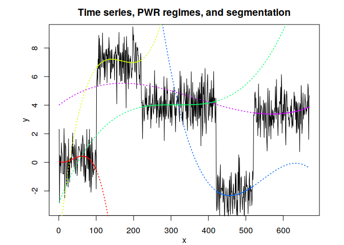
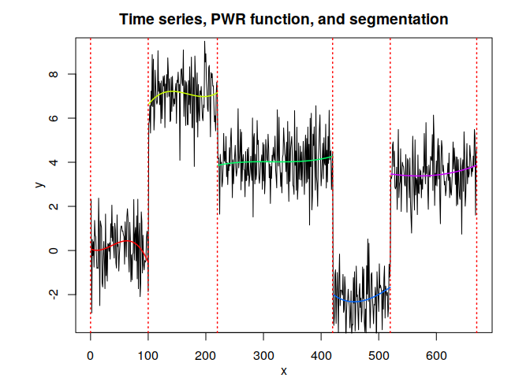

<!-- README.md is generated from README.Rmd. Please edit that file -->

## Overview

<!-- badges: start -->

<!-- badges: end -->

A polynomial piecewise regression model for the optimal segmentation of
a time series with regime changes. It uses dynamic programming for the
segmentation and the LSE for the estimation of the regression
parameters.

## Installation

You can install the development version of RHLP from
[GitHub](https://github.com/) with:

``` r
# install.packages("devtools")
devtools::install_github("fchamroukhi/PWR_R")
```

To build *vignettes* for examples of usage, type the command below
instead:

``` r
# install.packages("devtools")
devtools::install_github("fchamroukhi/PWR_R", 
                         build_opts = c("--no-resave-data", "--no-manual"), 
                         build_vignettes = TRUE)
```

Use the following command to display vignettes:

``` r
browseVignettes("PWR")
```

## Usage

``` r
library(PWR)

data("toydataset")

K <- 5 # Number of segments
p <- 3 # Polynomial degree

pwr <- fitPWRFisher(toydataset$x, toydataset$y, K, p)

pwr$plot()
```


