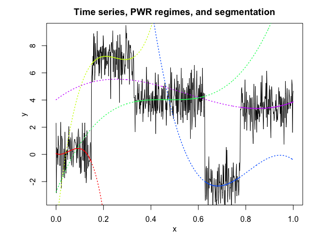
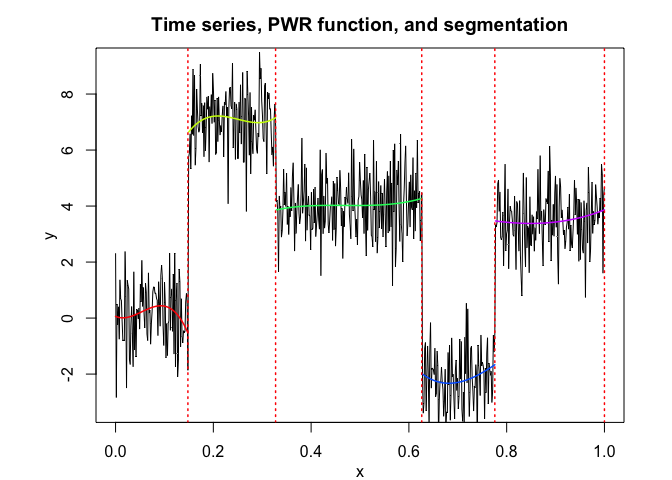
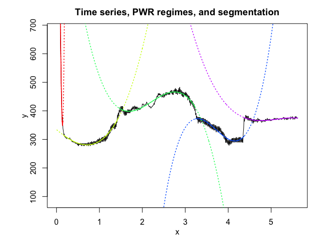
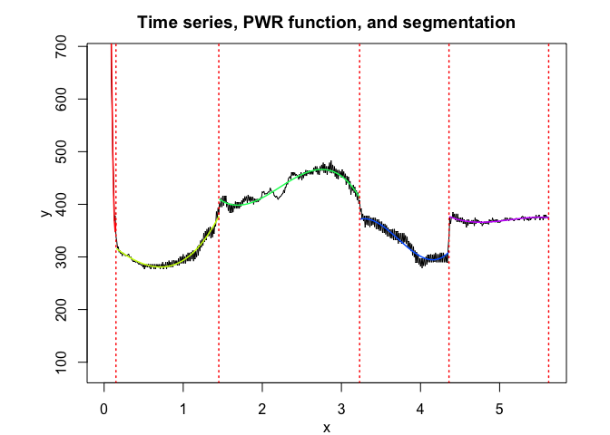

<!-- README.md is generated from README.Rmd. Please edit that file -->

# Overview

<!-- badges: start -->

<!-- badges: end -->

**PWR**: Piecewise Regression (PWR) for time series (or structured
longitudinal data) modeling and optimal segmentation by using optimized
dynamic programming.

# Installation

You can install the PWR package from [GitHub](https://github.com/) with:

``` r
# install.packages("devtools")
devtools::install_github("fchamroukhi/PWR_R")
```

To build *vignettes* for examples of usage, type the command below
instead:

``` r
# install.packages("devtools")
devtools::install_github("fchamroukhi/PWR_R", 
                         build_opts = c("--no-resave-data", "--no-manual"), 
                         build_vignettes = TRUE)
```

Use the following command to display vignettes:

``` r
browseVignettes("PWR")
```

# Usage

``` r
library(PWR)
```

``` r
# Application to a toy data set
data("toydataset")

K <- 5 # Number of segments
p <- 1 # Polynomial degree

pwr <- fitPWRFisher(toydataset$x, toydataset$y, K, p)

pwr$plot()
```



``` r
# Application to a real data set
data("realdataset")

K <- 5 # Number of segments
p <- 3 # Polynomial degree

pwr <- fitPWRFisher(realdataset$x, realdataset$y2, K, p)

pwr$plot()
```


